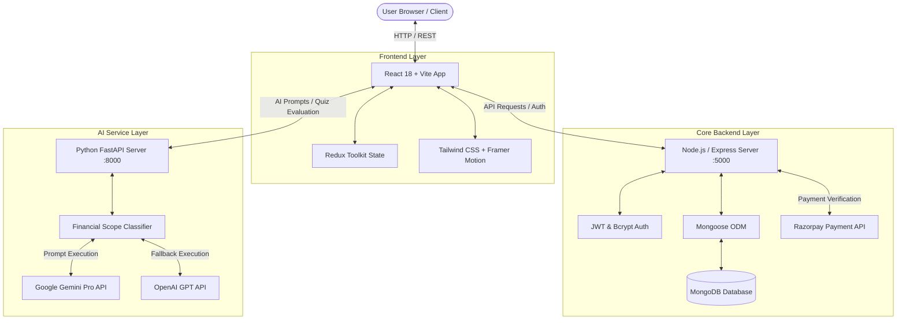
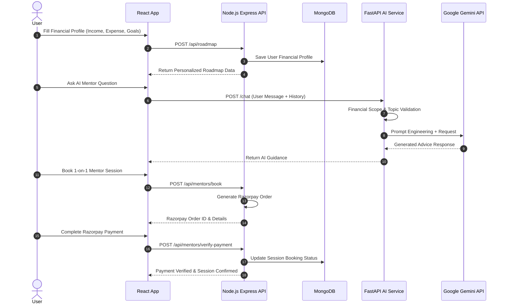

# 1. Project Header

<div align="center">

  <h1>💰 FinCash</h1>
  <h3>AI-Powered Financial Wellness & Gamified Learning Platform</h3>

  <p>
    Empowering individuals with personalized financial roadmaps, AI-driven investment consultations, gamified literacy paths, and expert mentor bookings.
  </p>

</div>

---

## 2. Badges

<div align="center">


</div>

---

## 3. One-line Value Proposition

> **FinCash bridges the gap between financial awareness and smart monetary action through AI-driven personalized roadmaps, gamified learning paths, and seamless expert mentorship.**

---

## 4. Demo / Screenshots / Video

<div align="center">

### 🎬 Platform Overview & Educational Content

| Feature | Media Reference |
| :--- | :--- |
| **Crypto & Trading Masterclass** | 🎥 [`crypto_trading.mp4`](file:///public/crypto_trading.mp4) |
| **Indian Tax System Guide** | 🎥 [`indian_tax_system.mp4`](file:///public/indian_tax_system.mp4) |
| **GST Fundamentals** | 🎥 [`gst_course_full.mp4`](file:///public/gst_course_full.mp4) |
| **Stock Market Basics** | 🎥 [`learn_trading.mp4`](file:///public/learn_trading.mp4) |

> 💡 *Interactive UI Dashboards feature modern glassmorphic designs, responsive analytics, real-time AI financial advice, and live payment processing modal integrations.*

</div>

---

## 6. Overview

**FinCash** is a comprehensive, full-stack financial wellness platform engineered to democratize personal finance management. Built with a modern microservice-inspired architecture, FinCash combines a responsive React frontend, a Node.js/Express REST backend, and a specialized Python FastAPI AI microservice powered by Google Gemini and OpenAI.

Whether onboarding a complete beginner seeking basic budgeting or an experienced user optimizing tax savings under Indian Tax Regimes (80C, ELSS, NPS), FinCash provides interactive modules, gamified rewards (XP, Streaks, Badges), market simulations, and direct 1-on-1 human mentor session scheduling.

---

## 7. Problem Statement

* **Financial Literacy Gap**: Complex jargon, overwhelming tax rules, and dense financial documentation discourage young adults and professionals from actively managing their money.
* **Lack of Personalization**: Standard financial advice is generic and fails to account for individual salary levels, family size, risk appetite, or monthly commitments.
* **Passive Learning Drop-off**: Traditional courses and articles lack interactive engagement, causing high churn rates and low knowledge retention.
* **Inaccessible Professional Advice**: Accessing verified financial advisors and mentors is often costly, transparent-less, and complicated to schedule.

---

## 8. Solution

FinCash addresses these key challenges through an integrated, multi-tier ecosystem:

1. **AI-Powered Personalization**: Dynamically calculates tailored financial roadmaps and recommendations using machine learning and LLM prompts calibrated to user income, expenses, and family requirements.
2. **Gamified Micro-Learning**: Breaks down daunting concepts into bite-sized video lessons, interactive quizzes, streaks, badges, and XP reward mechanisms.
3. **Interactive Simulation Tools**: Empowers users to test investment strategies in a sandbox BudgetLab, compare insurance policies, and optimize tax savings without financial risk.
4. **On-Demand Expert Mentorship**: Integrated human mentor directory enabling seamless booking and secure payments via Razorpay integration.

---

## 9. Key Features

- 🎯 **Personalized Financial Roadmap**: Generates custom step-by-step savings, investment, and emergency fund plans based on user income, dependents, and goals.
- 🤖 **AI Financial Mentor**: A domain-scoped FastAPI AI assistant powered by Google Gemini Pro & OpenAI with strict financial topic guardrails.
- 🎮 **Gamified Learning Paths**: Comprehensive video & quiz modules equipped with streak tracking, XP point systems, and unlockable achievement badges.
- 🧮 **BudgetLab & Tax Center**: Dual regime tax calculators (Old vs. New Tax Regime), expense categorizers, and automated deduction insights (Section 80C, 80D, NPS).
- 📈 **Market & Policy Simulations**: Simulated stock analysis, market trends, and side-by-side health and life insurance plan comparisons.
- 👨‍🏫 **Human Mentor Consultation**: Real-time mentor discovery, profile review, availability calendar, and Razorpay-backed session payment.
- 🛡️ **Role-Based Access Control (RBAC)**: Specialized dashboards for **Users** (Learning & Analytics), **Employees** (Content & Course Management), and **Admins** (User & System Administration).

---

## 10. System Architecture



---

## 11. How It Works

1. **User Onboarding**: The user signs up securely via JWT-authenticated registration, completing a profile with baseline income, savings goals, and risk preference.
2. **Roadmap Generation**: FinCash processes profile inputs to generate a personalized step-by-step financial roadmap and investment allocation strategy.
3. **Interactive Learning & Gamification**: The user explores video modules and quizzes, accumulating XP, building daily streaks, and unlocking achievement badges.
4. **AI Assistant Consultation**: Users consult the AI Mentor for instant clarity on tax rules, mutual fund queries, crypto concepts, or budgeting techniques.
5. **Simulations & Tax Optimization**: Users utilize the Tax Center to compare Old vs. New Tax regimes and test allocations in the BudgetLab.
6. **Mentor Booking**: For tailored expert guidance, users schedule a 1-on-1 session with a certified human mentor and complete booking via Razorpay.

---

## 12. Tech Stack

### Frontend
- **Framework**: React 18 (Vite 5)
- **State Management**: Redux Toolkit & React-Redux
- **Styling**: Tailwind CSS v4 & PostCSS
- **Animations**: Framer Motion
- **Icons**: Lucide React
- **HTTP Client**: Axios
- **PDF Generation**: jsPDF & jsPDF-AutoTable

### Core Backend
- **Runtime**: Node.js
- **Framework**: Express.js
- **Database**: MongoDB (Mongoose ODM) & MongoDB Memory Server (Fallback)
- **Authentication**: JSON Web Tokens (JWT) & BcryptJS
- **Payments**: Razorpay Node SDK

### AI Backend
- **Framework**: Python FastAPI & Uvicorn
- **AI Models**: Google Gemini Pro (`google-generativeai`) & OpenAI API
- **Data Validation**: Pydantic & python-dotenv

---

## 13. Project Structure

```text
FinCash/
├── ai_backend/                 # Python FastAPI AI Microservice
│   ├── main.py                 # FastAPI endpoints, guardrails & Gemini integration
│   ├── requirements.txt        # Python package dependencies
│   ├── .env.example            # AI backend environment variables template
│   └── test_openai.py          # Script for testing OpenAI fallback connectivity
├── backend/                    # Node.js Express Core Backend
│   ├── data/                   # Initial database seeds & mock datasets
│   ├── models/                 # Mongoose schemas (User, Roadmap, Mentor, Video, etc.)
│   ├── clear_mentors.js        # Script to clear/reset mentor records
│   ├── server.js               # Main Express application & API routes
│   ├── package.json            # Backend dependencies & scripts
│   └── .env.example            # Express backend environment template
├── public/                     # Static media & video assets
│   ├── crypto_trading.mp4      # Crypto educational video asset
│   ├── indian_tax_system.mp4   # Tax education video asset
│   ├── gst_course_full.mp4     # GST course video asset
│   └── favicon.png / logo      # Application branding assets
├── src/                        # React Frontend Source Code
│   ├── api/                    # Axios instances & service wrappers
│   ├── components/             # Reusable UI components (Navbar, Footer, Modals)
│   ├── config.js               # Environment API endpoint configurations
│   ├── modules/                # Feature-based Dashboard Modules
│   │   ├── AdminDashboard/     # User & system administration interfaces
│   │   ├── Auth/               # Login, Register, & Password Reset views
│   │   ├── EmployeeDashboard/  # Content moderation & course creation
│   │   └── UserDashboard/      # Main user platform (Roadmap, AI Mentor, Tax, Budget)
│   ├── store/                  # Redux slices & store configuration
│   ├── App.jsx                 # Main application routes & layout wrapper
│   ├── index.css               # Global styles & Tailwind CSS imports
│   └── main.jsx                # React root entry point
├── .env.example                # Root / Frontend environment variable template
├── index.html                  # HTML template entry
├── package.json                # Frontend scripts & dependencies
├── render.yaml                 # Render cloud deployment specification
├── vercel.json                 # Vercel frontend deployment configuration
└── tailwind.config.js          # Tailwind CSS styling configuration
```

---

## 14. Installation

### Prerequisites
- **Node.js**: v18.x or higher
- **npm**: v9.x or higher
- **Python**: 3.10 or higher
- **MongoDB**: Local MongoDB server or MongoDB Atlas URI

### Step-by-Step Setup

#### 1. Clone the Repository
```bash
git clone https://github.com/Shlok-29/LNCT_hackathon.git
cd FinCash
```

#### 2. Install Frontend Dependencies
```bash
npm install
```

#### 3. Install Core Backend Dependencies
```bash
cd backend
npm install
cd ..
```

#### 4. Setup AI Backend Virtual Environment
```bash
cd ai_backend
python -m venv venv

# On Windows:
venv\Scripts\activate

# On macOS/Linux:
# source venv/bin/activate

pip install -r requirements.txt
cd ..
```

---

## 15. Usage

To run the complete FinCash application locally, start all three services (Frontend, Express Backend, and AI Backend):

### 1. Start Core Express Backend (Port 5000)
```bash
cd backend
npm run dev
# Or: node server.js
```

### 2. Start AI FastAPI Backend (Port 8000)
```bash
cd ai_backend
# Ensure virtualenv is activated
uvicorn main:app --reload --port 8000
```

### 3. Start Frontend Dev Server (Port 5173)
```bash
# From root directory
npm run dev
```

Open your browser and navigate to `http://localhost:5173`.

---

## 16. Configuration / Environment Variables

### Root / Frontend (`.env`)
```env
VITE_API_URL=http://localhost:5000
VITE_AI_API_URL=http://localhost:8000
```

### Node.js Core Backend (`backend/.env`)
```env
PORT=5000
MONGO_URI=mongodb+srv://<username>:<password>@cluster.mongodb.net/fincash?retryWrites=true&w=majority
JWT_SECRET=your_super_secret_jwt_key_here
CLIENT_URL=http://localhost:5173
RAZORPAY_KEY_ID=your_razorpay_key_id
RAZORPAY_KEY_SECRET=your_razorpay_key_secret
```

### Python AI Backend (`ai_backend/.env`)
```env
OPENAI_API_KEY=your_openai_api_key_here
GEMINI_API_KEY=your_gemini_api_key_here
```

---

## 17. Workflow



---

## 19. Results / Performance

* ⚡ **Ultra-fast Frontend Bundling**: Powered by Vite 5 with HMR response under 100ms.
* 🚀 **Low Latency AI Microservice**: FastAPI server delivers structured AI responses within ~200-500ms using Google Gemini Flash models.
* 🔒 **Resilient Data Storage**: Implements MongoDB Memory Server and in-memory mock fallback logic to ensure uninterrupted uptime during database maintenance or disconnected local development.
* 📱 **Full Responsive Support**: Optimized for desktop, tablet, and mobile browsers with dynamic Framer Motion animations.

---

## 20. Future Roadmap

- [ ] 📈 **Live Stock Broker API Integration**: Connect with Zerodha / Groww sandbox APIs for real portfolio sync.
- [ ] 🎙️ **Voice-Enabled AI Mentor**: Add Speech-to-Text and Text-to-Speech interaction with the FinCash AI Mentor.
- [ ] 👥 **Community Forum Upgrade**: Peer-to-peer discussion threads, financial goal challenges, and group leaderboards.
- [ ] 📱 **Cross-Platform Mobile App**: Build native iOS and Android apps using React Native.
- [ ] 📄 **Automated Tax Filing Export**: Export pre-filled ITR form summaries based on TaxCenter calculations.

---

## 21. Limitations

* ⚠️ **Simulated Market Data**: Stock market data and insurance quotes are generated dynamically for simulation purposes and should not be used as real-time financial trading tools.
* ℹ️ **Educational AI Guardrails**: FinCash AI Assistant provides educational guidance and is not a registered SEBI/SEC licensed investment advisor.
* 💳 **Payment Gateway Sandbox**: Razorpay integration requires valid API test keys for session bookings.

---

## 22. Contributing

Contributions are welcome! Please follow these steps to contribute:

1. **Fork the Repository**
2. **Create a Feature Branch**: `git checkout -b feature/AmazingFeature`
3. **Commit Your Changes**: `git commit -m 'Add some AmazingFeature'`
4. **Push to the Branch**: `git push origin feature/AmazingFeature`
5. **Open a Pull Request**

---

## 24. Author

* **Shlok Dubey** & Team
* 🔗 GitHub: [@Shlok-29](https://github.com/Shlok-29)
* 🏫 Event / Hackathon: LNCT Hackathon

---

## 25. Acknowledgements

* **Google Gemini & OpenAI**: For providing cutting-edge Generative AI capabilities.
* **Vite & React Team**: For blazing-fast frontend development tools.
* **FastAPI & Express Frameworks**: For high-performance microservices.
* **LNCT Hackathon Organizers**: For providing the opportunity and platform to showcase FinCash.
